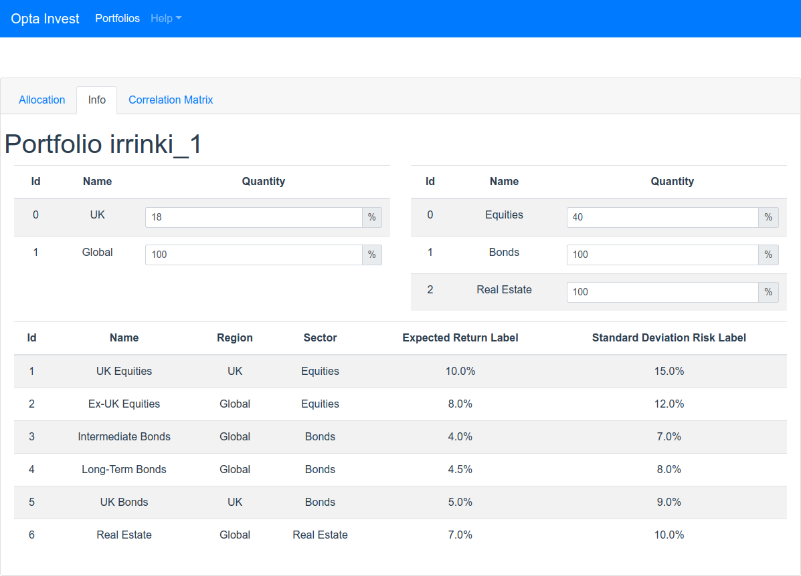
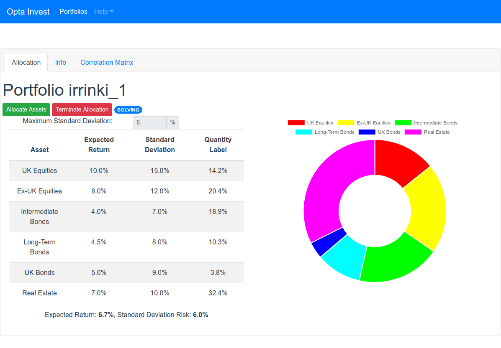

# opta-invest

This project is a web version of the Investment allocation sample that comes with Optaplanner. It uses an async execution pool (using Spring Boot) to solve a problem instance, and updates the UI using Websockets.

Vue.js + Spring Boot + Optaplanner Investment allocation.

## Screenshots

Portfolio List

Assets Constraints

Allocations

## Run in development mode

This project is divided in 2 sub modules:

### Server

To run the server module, run on `server` folder:

    gradle bootRun

This command will run a Spring Boot application on port `8080`.

### Client

To run the client module, make sure you have node and yarn installed on your system, then run on `client` folder:

    yarn start

Point your browser to `http://localhost:3000`. This module will run on port `3000`, but will proxy remote calls to port `8080`.

### Both Modules

Gradle can run both modules together

    gradle bootRun -parallel

This task will run both modules on port `3000` and `8080`.

## Build assembled jar

To build a jar that contains both server and client modules assembled on the same app. Just run the task on the root folder:

    gradle assembleServerAndClient

## Docker

A full packaged docker image (with belgium map) can be found at Dockerhub. To run the opta-invest image:

    docker run -p 8080:8080 pintowar/opta-invest

Point your browser to `http://localhost:8080`.